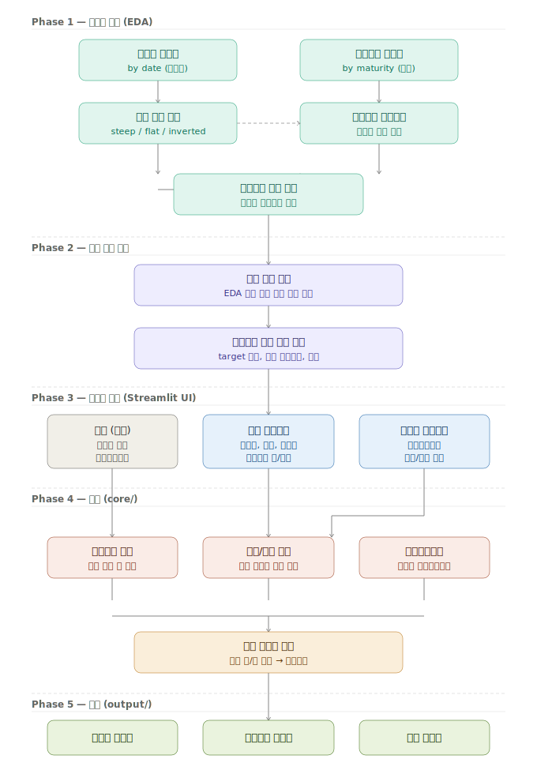

# 채권펀드 제안서 생성기

금통위 시나리오별 기준금리 전망을 반영한 채권펀드(중단기+레포조달) 수익률 분석 및 제안서 자동 생성 도구.

---

## 전체 흐름



---

## Phase 1 — 데이터 탐색 (EDA)

편입자산 구성 및 펀드 만기 결정에 앞서 시장 데이터를 먼저 분석

- **섹터별 수익률** (`data/raw/sector_yields.csv`) — 시계열 기준, 섹터별 금리 추이 파악
- **발행자별 수익률** (`data/raw/issuer_yields.csv`) — 현재 시점 기준, 만기별 금리 수준 파악
- **커브 구조 파악** — steep / flat / inverted 여부 확인
- **신용등급 스프레드** — 등급별 분포 및 이상치 확인
- **롤링효과 유효 구간** — 만기 구간별 추가수익 추정 (EDA 핵심 산출물)

> EDA 결과는 `DECISIONS.md`에 기록하여 펀드 설계 근거로 활용한다.

---

## Phase 2 — 펀드 설계 결정

EDA 결과를 바탕으로 아래 두 가지를 확정한다.

| 결정 사항 | 내용 |
|-----------|------|
| **펀드 만기** | 수익률이 유리한 만기 구간 선택 |
| **편입자산 구성 규칙** | target 만기, 커브 허용범위, 최대 편입 개수 |

---

## Phase 3 — 사용자 입력 (Streamlit UI)

`ui/app.py` 를 실행하면 웹 인터페이스에서 아래 값을 입력한다.

### 상수 (고정값, `config/constants.py`)
- 금통위 일정 (연간 8회)
- 현금성자산 규제 비율

### 펀드 파라미터 (매 펀드마다 입력)
- 개시일
- 펀드 만기
- 설정액
- 편입자산 신용등급 상한 / 하한

### 금통위 시나리오 (입력)
- 레포차입비율
- 각 금통위별 금리 가정 (인상 / 동결 / 인하 / bp 폭)

---

## Phase 4 — 계산 (`core/`)

| 모듈 | 역할 |
|------|------|
| `asset_selector.py` | 신용등급·만기 조건 필터 후 금리 높은 순 정렬, 편입 자산 확정 |
| `curve_analysis.py` | 커브 구조 판단, 롤링효과 유의미 여부 결정 |
| `repo_cost.py` | 금통위 일정 × 시나리오 → 구간별 일수 계산 → 가중평균금리 산출 |
| `return_calculator.py` | 롤링 유/무 분기 처리 → 최종 순수익률 계산 |

### 가중평균금리 계산 예시

```
현재 기준금리: 3.50%
개시일: 2025-03-01 / 만기: 6개월 (182일)

금통위 일정:
  2025-04-17  동결  → 3.50%
  2025-05-29  -25bp → 3.25%
  2025-07-10  동결  → 3.25%

구간별 일수:
  03-01 ~ 04-17:  47일 @ 3.50%
  04-17 ~ 05-29:  42일 @ 3.50%
  05-29 ~ 07-10:  42일 @ 3.25%
  07-10 ~ 08-30:  51일 @ 3.25%

가중평균 = (47×3.50 + 42×3.50 + 42×3.25 + 51×3.25) / 182
         = 3.37%
```

---

## Phase 5 — 출력 (`output/`)

- **수익률 비교표** — 시나리오별 조달비용 vs 자산수익률 비교
- **시장동향 그래프** — 대표 자산 수익률 추이 시각화
- **최종 제안서** — 위 내용을 종합한 PDF/HTML 보고서

---

## 프로젝트 구조

```
bond-fund-proposal/
├── CLAUDE.md                  ← AI 컨텍스트
├── DECISIONS.md               ← EDA 결과 및 설계 근거 기록
├── README.md
│
├── config/
│   ├── constants.py           ← 금통위 일정, 현금규제비율 (hardcoded)
│   └── fund_params.py         ← 기본 파라미터
│
├── data/
│   ├── raw/
│   │   ├── sector_yields.csv
│   │   └── issuer_yields.csv
│   └── loader.py
│
├── eda/
│   ├── yield_explorer.py      ← 섹터/만기별 수익률 시각화
│   ├── curve_snapshot.py      ← 현재 커브 구조
│   └── spread_analysis.py     ← 신용등급별 스프레드
│
├── core/
│   ├── repo_cost.py
│   ├── asset_selector.py
│   ├── curve_analysis.py
│   └── return_calculator.py
│
├── ui/
│   ├── app.py                 ← Streamlit 메인
│   ├── inputs.py              ← 입력 위젯
│   └── display.py             ← 결과 렌더링
│
├── output/
│   ├── charts.py
│   └── report.py
│
└── main.py                    ← CLI 실행
```

---

## 미결 사항 (TODO)

- [ ] 커브 분석 방법 확정 (단순 스프레드 vs 넬슨-시겔)
- [ ] 롤링효과 유의미 판단 임계값 설정
- [ ] 편입자산 선택 시 만기 허용 범위 결정
- [ ] 그래프 대표 자산 선정 기준
